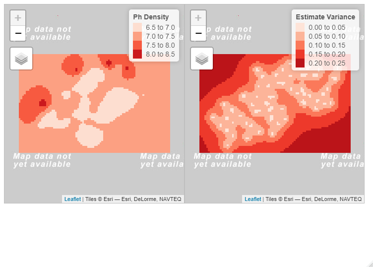

```{r setup, include=FALSE}
knitr::opts_chunk$set(echo = TRUE, fig.pos = 'H')
```

Due 5:15 pm, April 15, 2020

The Ph in soil samples taken in the Great Smokey Mountain National Park are in the file SmokeyMountain.eps. The first few lines of this file are shown below.

```{r echo=FALSE}
d = data.table::fread("homework/SmokeyMountain.csv")
knitr::kable(head(d), booktabs = T)
```

Use the methods of section 6.8 in the book, including

- Nearest neighbor interpolation (using Voronoi polygons)
- Inverse distance weighting (use $\alpha = 0.5$).
- Kriging (in the semivariogram, give an eyeball estimate of the sill, range, and nugget.)

Explain your reasoning and justify your assertions with the appropriate plots. Submit a PDF file to Blackboard, obtained either by using Word with copy & paste from R, or by creating a PDF file in RMarkdown.

Important note: If you follow the book's development on the fulmar data set, notice that fulmar is the name of the data frame and also one of the variables in the data frame. This can be confusing because you can’t tell whether you should tell R what the data frame is or which variable in the data from to refer to. Sometimes fulmar would translate to smokeyMountain (if you call your data frame smokeyMountain) and sometimes fulmar would translate to Ph (if you're referring to the outcome variable in the data frame).

<!--
Second, for the homework on the smokey mountain data, use only the (easting,northing) data, and of course the ph data.  The z variable (elevation) might come into play in a more thorough analysis, but I'm not asking you to do this.
-->

Nearest neighbor interpolation (using Voronoi polygons)
=======================================================

```{r}
pacman::p_load(sp, deldir, tmap, gstat)

# Modified Carson Farmer code
voronoipolygons = function(layer) {
  crds <- layer@coords
  z <- deldir(crds[,1], crds[,2])
  w <- tile.list(z)
  polys <- vector(mode='list', length=length(w))
  for (i in seq(along=polys)) {
    pcrds <- cbind(w[[i]]$x, w[[i]]$y)
    pcrds <- rbind(pcrds, pcrds[1,])
    polys[[i]] <- Polygons(list(Polygon(pcrds)),
                           ID=as.character(i))
  }
  SP <- SpatialPolygons(polys)
  voronoi <- SpatialPolygonsDataFrame(SP, 
                data=data.frame(x=crds[,1], 
                                y=crds[,2], 
                                layer@data,
                                row.names=sapply(slot(SP, 'polygons'), 
                                                 function(x) slot(x, 'ID'))))
  proj4string(voronoi) <- CRS(proj4string(layer))
  return(voronoi)
}
```

Nearest neighbour interpolation estimate the outcome ph at location ($x$, $y$) at the observation point closest to ($x$, $y$).

```{r fig.cap='Nearest neighbour interpolation of the smokey mountain data: points and Voronoi diagram'}
sm_sp = SpatialPointsDataFrame(d[,.(x = Easting, y = Northing)],
                               d[,.(x = Easting, y = Northing, Ph)])
proj4string(sm_sp) = CRS("+init=epsg:32631")
sm_voro = voronoipolygons(sm_sp)

tm_shape(sm_voro) + 
  tm_fill(col = 'Ph', title = 'Ph') + 
  tm_borders() + 
  tm_dots(size = 0.1)
```


Inverse distance weighting (use $\alpha = 0.5$)
===============================================
The *inverse distance weighting* (IDW) approach estimate the outcome ph at location ($x$, $y$) with a weighted mean of nearby observations.

```{r}
sample_sm = spsample(sm_voro, type = 'regular', n = 5000)
idw_est = gstat::idw(Ph ~ 1, locations = sm_sp, newdata = sample_sm, idp = 0.5)

tmap_mode("view")
tm_shape(idw_est) + 
  tm_dots(col = 'var1.pred')
```


Kriging
=======
Kriging defines the outcome $z$ at location $x_i$ using the following function:

$$z(x_i) = f(x_i) + \nu(x_i) + \epsilon_i$$

where $f(x_i)$ is the true function, $\nu(x_i)$ is a random function, and $\epsilon_i \sim \text{i.i.d. Normal}(0, \sigma^2)$.

```{r fig.cap='Kriging semivariogram for the Great Smokey Mountain data'}
sm_evgm = variogram(Ph ~ 1, sm_sp)
sm_fvgm = fit.variogram(sm_evgm, vgm('Mat'))
plot(sm_evgm, model = sm_fvgm)
```

An eyeball estimate of the sill, range, and nugget:

- **sill** (the $z$ value where the semivariogram first becomes flat): 0.19
- **range** (the $d$ value where the semivariogram first becomes flat): 45
- **nugget** (the $z$-value at a distance of 0): 0.01.

```{r}
sample_sm = spsample(sm_voro, type = 'regular', n = 5000)
krig_est = krige(Ph ~ 1, sm_sp, newdata = sample_sm, model = sm_fvgm)
krig_grid = SpatialPixelsDataFrame(krig_est, krig_est@data)
```

```{r eval=FALSE}
krig_map_est = tm_shape(krig_grid) + 
  tm_raster(col = 'var1.pred', title = 'Ph Density', palette ='Reds') + 
  tm_layout(legend.bg.color = 'white',legend.frame = TRUE)

krig_map_var = tm_shape(krig_grid) + 
  tm_raster(col = 'var1.var', title = 'Estimate Variance', palette='Reds') + 
  tm_layout(legend.bg.color = 'white', legend.frame = TRUE)

tmap_arrange(krig_map_est, krig_map_var, ncol = 2)
```

```{r fig.cap='Kriging estimates of Ph density (left) and associated variance (right) for the Great Smokey mountain data', echo=FALSE, out.width = "\\textwidth"}

```

